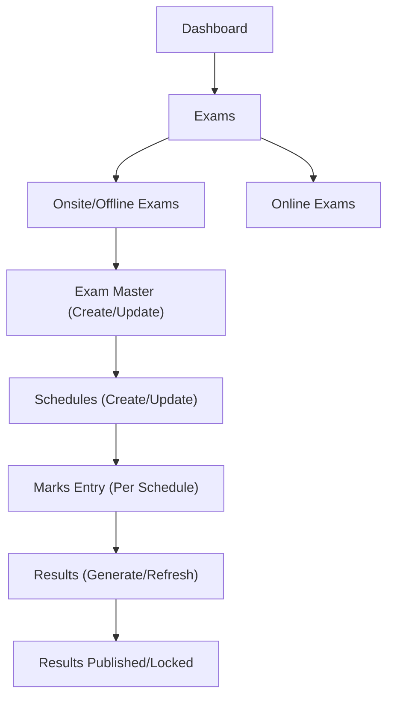

## 1. Product Overview
Expand the existing **Exams** module into a complete school exam-management workspace.
You can manage exam master data, schedules, marks entry, and the results lifecycle within the current sidebar **Exams** route.

## 2. Core Features

### 2.1 User Roles
| Role | Registration Method | Core Permissions |
|------|---------------------|------------------|
| School Admin | Created/managed in **Settings → Users** | Full access to exam setup, schedules, marks, and results; can publish/lock. |
| Exam Officer | Created/managed in **Settings → Users** | Create/update exams and schedules; generate/publish results. |
| Teacher / Marker | Created/managed in **Settings → Users** | Enter/update marks for assigned schedules; view results. |
| Read-only Viewer | Created/managed in **Settings → Users** | View exams, schedules, marks (read), and results (read). |

### 2.2 Feature Module
Our exam-management requirements consist of the following pages:
1. **Login**: authenticate into the school workspace.
2. **Exams**: overview, offline exam setup (master + schedules), marks entry, results lifecycle, online exams (existing).

### 2.3 Page Details
| Page Name | Module Name | Feature description |
|-----------|-------------|---------------------|
| Login | Credentials form | Sign in with email/password; show validation and errors. |
| Exams | Primary navigation tabs | Switch between **Overview**, **Onsite/Offline Exams**, **Online Exams** without adding sidebar items. |
| Exams | Overview dashboard | Show quick entry points for: Exam Master, Schedules, Marks Entry, Results; show lightweight status hints (e.g., draft/published). |
| Exams (Onsite/Offline) | Exam Master list | List exams for current academic year; filter by exam type; show key lifecycle fields; open add/edit; publish exam. |
| Exams (Onsite/Offline) | Exam Master add/edit | Capture required master fields: name, exam code, exam type, start/end dates, weight %, included in final result, best-of count, aggregation method, counts for GPA, result entry deadline, result publish date, results editable flag, instructions, status. |
| Exams (Onsite/Offline) | Schedule management | Create/update/delete schedules per **exam + class + subject** with date/time, room, max marks; support bulk create for faster setup. |
| Exams (Onsite/Offline) | Marks entry workspace | Select schedule; load class roster; enter marks per student with absent + remarks; validate against max marks; save in bulk (upsert). |
| Exams (Onsite/Offline) | Results generation | Generate/refresh results for an exam (and optional class scope); show computed totals/percent/grade; allow regeneration after mark changes. |
| Exams (Onsite/Offline) | Results publish/lock | Publish results by setting exam status/publish date; lock editing by setting results editable flag off (and reflect locked state in UI). |
| Exams (Online) | Question bank | Manage categories and questions (existing UI); support filtering and activation. |
| Exams (Online) | Online exam configs | Bind configs to schedules; set duration, window, attempts, shuffling; assign questions (existing UI). |
| Exams (Online) | Attempts view | View attempts list with status and score (existing UI). |

## 3. Core Process
**Offline exam setup → results flow**
1. You create an exam for the current academic year and complete all master fields.
2. You create exam schedules (per class + subject), including max marks.
3. You publish the exam schedule (existing “Publish” action on exam; becomes the official exam configuration).
4. Teachers enter marks per schedule; the system validates marks ≤ max marks and supports absent entries.
5. You generate results for the exam (and optionally per class). Generation is repeatable if marks change.
6. You publish results (status + publish date) and optionally lock results from further edits.

