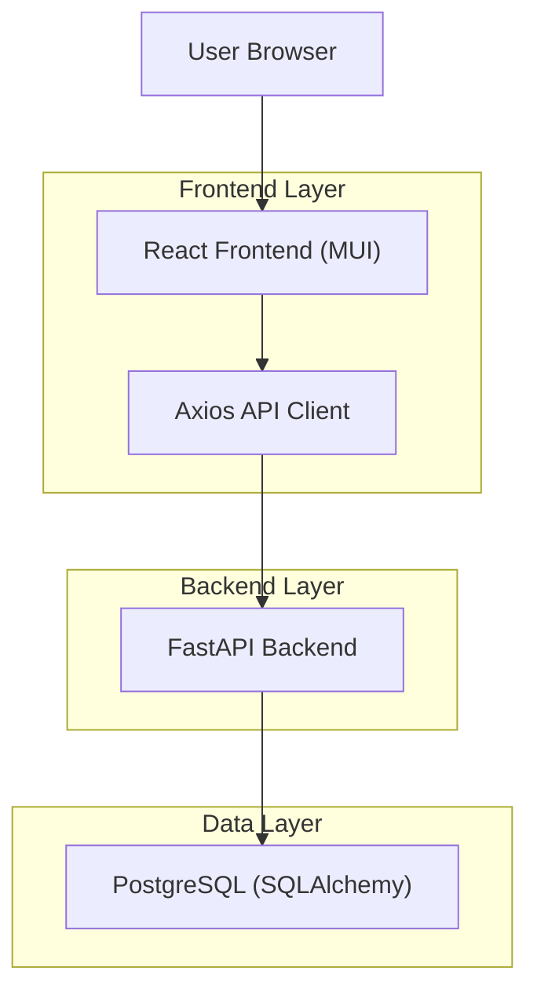
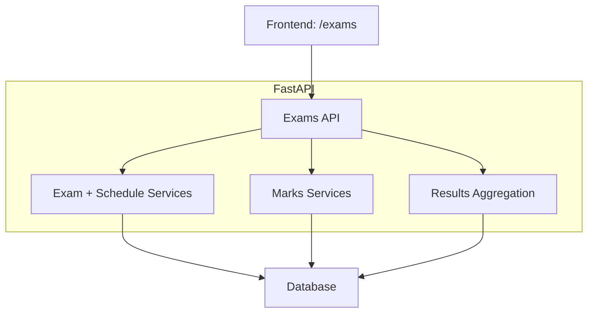
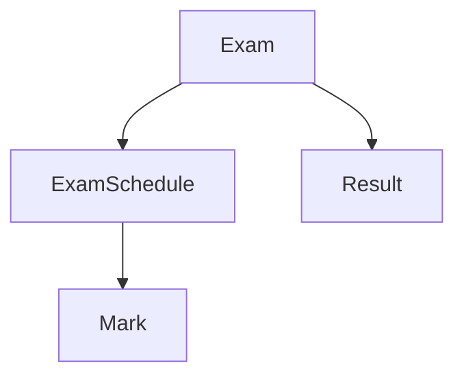

## 1.Architecture design


## 2.Technology Description
- Frontend: React@18 + TypeScript + MUI + vite
- Backend: FastAPI + SQLAlchemy + Alembic
- Database: PostgreSQL

## 3.Route definitions
| Route | Purpose |
|-------|---------|
| /login | Authenticate user |
| /exams | Single workspace for exam master, schedules, marks entry, results, and online exams |

## 4.API definitions
### 4.1 Core API (existing backend; UI must fully cover)
Exam master
- GET /exams?academic_year_id=
- POST /exams
- PUT /exams/{exam_id}
- POST /exams/{exam_id}/publish

Exam schedules
- GET /exam-schedules?exam_id=&class_id=
- POST /exam-schedules
- PUT /exam-schedules/{schedule_id}
- DELETE /exam-schedules/{schedule_id}
- POST /exam-schedules/bulk-create

Marks
- GET /marks?exam_schedule_id=&class_id=&student_id=
- POST /marks/enter (bulk upsert)

Results
- GET /results?exam_id=&class_id= (computes and upserts results)

### 4.2 Shared TypeScript types (frontend)
The frontend should extend its existing types to match backend schemas.
```ts
export type Exam = {
  id: string;
  academic_year_id: string;
  name: string;
  exam_code: string | null;
  exam_type_code: string | null;
  exam_type: string | null;
  status: string;
  start_date: string | null;
  end_date: string | null;
  weight_percentage: number | null;
  included_in_final_result: boolean;
  best_of_count: number | null;
  aggregation_method: string | null;
  counts_for_gpa: boolean;
  result_entry_deadline: string | null;
  result_publish_date: string | null;
  is_result_editable: boolean;
  instructions: string | null;
  is_published: boolean;
};

export type ExamSchedule = {
  id: string;
  exam_id: string;
  class_id: string;
  subject_id: string;
  exam_date: string;
  start_time: string | null;
  end_time: string | null;
  room: string | null;
  max_marks: number;
};

export type Mark = {
  id: string;
  exam_schedule_id: string;
  student_id: string;
  marks_obtained: number | null;
  is_absent: boolean;
  remarks: string | null;
};

export type Result = {
  id: string;
  exam_id: string;
  student_id: string;
  total_marks: number;
  obtained_marks: number;
  percentage: number;
  grade_id: string | null;
};
```

## 5.Server architecture diagram


## 6.Data model(if applicable)
### 6.1 Data model definition


### 6.2 Data Definition Language
(Concise subset; align with current models)
```sql
CREATE TABLE exams (
  id UUID PRIMARY KEY,
  academic_year_id UUID NOT NULL,
  name VARCHAR(150) NOT NULL,
  exam_code VARCHAR(64),
  exam_type_code VARCHAR(32),
  exam_type VARCHAR(64),
  status VARCHAR(24) NOT NULL DEFAULT 'draft',
  start_date DATE,
  end_date DATE,
  weight_percentage INTEGER,
  included_in_final_result BOOLEAN NOT NULL DEFAULT TRUE,
  best_of_count INTEGER,
  aggregation_method VARCHAR(24),
  counts_for_gpa BOOLEAN NOT NULL DEFAULT TRUE,
  result_entry_deadline DATE,
  result_publish_date DATE,
  locked_at TIMESTAMPTZ,
  is_result_editable BOOLEAN NOT NULL DEFAULT TRUE,
  instructions VARCHAR(4000),
  is_published BOOLEAN NOT NULL DEFAULT FALSE
);

CREATE TABLE exam_schedules (
  id UUID PRIMARY KEY,
  exam_id UUID NOT NULL,
  class_id UUID NOT NULL,
  subject_id UUID NOT NULL,
  exam_date DATE NOT NULL,
  start_time TIME,
  end_time TIME,
  room VARCHAR(50),
  max_marks INTEGER NOT NULL DEFAULT 100
);

CREATE TABLE marks (
  id UUID PRIMARY KEY,
  exam_schedule_id UUID NOT NULL,
  student_id UUID NOT NULL,
  marks_obtained INTEGER,
  is_absent BOOLEAN NOT NULL DEFAULT FALSE,
  remarks VARCHAR(255)
);

CREATE TABLE results (
  id UUID PRIMARY KEY,
  exam_id UUID NOT NULL,
  student_id UUID NOT NULL,
  total_marks INTEGER NOT NULL,
  obtained_marks INTEGER NOT NULL,
  percentage FLOAT NOT NULL,
  grade_id UUID
);
```
