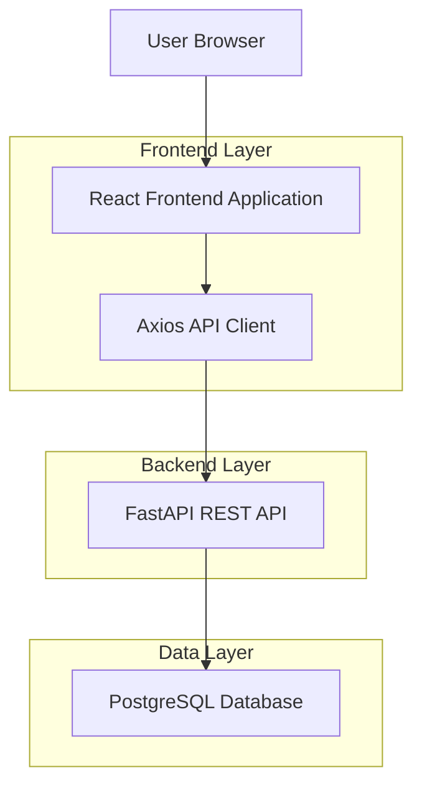
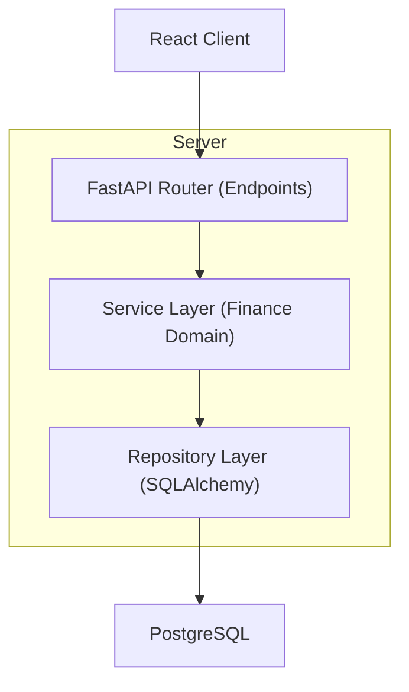
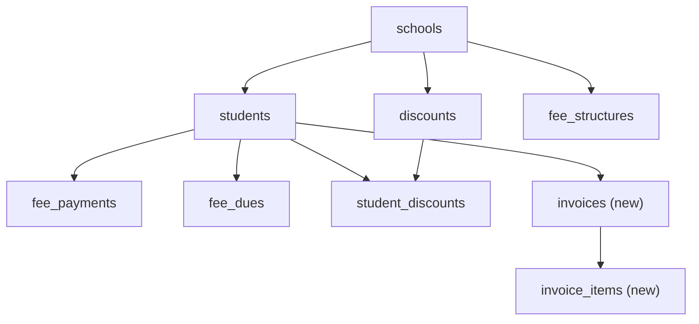

## 1.Architecture design


## 2.Technology Description
- Frontend: React@19 + react-router-dom@7 + MUI@7 + redux-toolkit + axios + react-hook-form + zod + recharts + vite
- Backend: FastAPI + Pydantic + SQLAlchemy + Alembic
- Database: PostgreSQL

## 3.Route definitions
| Route | Purpose |
|-------|---------|
| /finance | Finance workspace (fees, invoices, payments, dues, discounts, reports) |
| /finance/students/:studentId | Student finance ledger / statement and actions |
| /finance/documents/:type/:id | Printable invoice/receipt document viewer |

## 4.API definitions (If it includes backend services)
### 4.1 Core API
**Existing (already present in backend)**
- Fee Structures: `GET/POST/PUT/DELETE /api/v1/fee-structures` (+ `POST /api/v1/fee-structures/bulk-create`)
- Fee Dues: `GET /api/v1/fee-dues` (+ `/student/{id}`, `/defaulters`, `POST /calculate`)
- Fee Payments: `GET /api/v1/fee-payments` (+ `POST /collect`, `POST /refund/{id}`)
- Discounts: `GET/POST/PUT/DELETE /api/v1/discounts` (+ `POST /apply`, `DELETE /remove/{student_id}`)
- Finance Reports: `GET /api/v1/reports/financial/*`

**New (required for “Invoices”)**
- Invoices: `GET/POST /api/v1/invoices`, `GET /api/v1/invoices/{id}`, `POST /api/v1/invoices/{id}/issue`, `POST /api/v1/invoices/{id}/void`, `GET /api/v1/invoices/{id}/document`

### 4.2 Shared TypeScript types (frontend/backend contract)
```ts
export type Money = number; // stored as integer minor units if possible

export type FeeStructure = {
  id: string;
  academic_year_id: string;
  class_id: string;
  name: string;
  amount: Money;
  due_date?: string | null;
};

export type FeeDue = {
  id: string;
  student_id: string;
  academic_year_id: string;
  total_fee: Money;
  discount_amount: Money;
  paid_amount: Money;
  due_amount: Money;
  status: "paid" | "partial" | "due" | "overdue";
  last_calculated_date?: string | null;
};

export type FeePayment = {
  id: string;
  student_id: string;
  academic_year_id: string;
  payment_date: string;
  amount: Money;
  payment_method?: string | null;
  reference?: string | null;
  is_refund: boolean;
};

export type Discount = {
  id: string;
  school_id: string;
  name: string;
  discount_type: "percent" | "fixed";
  value: number;
  description?: string | null;
};

export type Invoice = {
  id: string;
  school_id: string;
  academic_year_id: string;
  student_id: string;
  status: "draft" | "issued" | "void";
  issue_date?: string | null;
  total_amount: Money;
  discount_amount: Money;
  net_amount: Money;
};
```

## 5.Server architecture diagram (If it includes backend services)


## 6.Data model(if applicable)
### 6.1 Data model definition


### 6.2 Data Definition Language
Invoices (new)
```sql
CREATE TABLE invoices (
  id UUID PRIMARY KEY,
  school_id UUID NOT NULL,
  academic_year_id UUID NOT NULL,
  student_id UUID NOT NULL,
  status VARCHAR(16) NOT NULL,
  issue_date DATE NULL,
  total_amount INTEGER NOT NULL,
  discount_amount INTEGER NOT NULL,
  net_amount INTEGER NOT NULL,
  created_at TIMESTAMP WITH TIME ZONE DEFAULT NOW()
);

CREATE TABLE invoice_items (
  id UUID PRIMARY KEY,
  invoice_id UUID NOT NULL,
  label VARCHAR(255) NOT NULL,
  amount INTEGER NOT NULL
);
```

Notes
- All finance endpoints must enforce RBAC via permission strings (e.g. `fee_payments:write`) and require active `X-School-Id`.
- Invoices should be generated from fee structures + student discounts, but remain a