## 1.Architecture design


## 2.Technology Description

* Frontend: React\@19 + react-router-dom\@7 + @reduxjs/toolkit + axios + MUI (@mui/material) + react-hook-form + zod + recharts

* Backend: FastAPI\@0.115 + SQLAlchemy\@2 + Alembic + psycopg + python-jose + passlib/bcrypt

* Database: PostgreSQL

## 3.Route definitions

| Route                  | Purpose                                             |
| ---------------------- | --------------------------------------------------- |
| /logistics             | Logistics workspace (tabs + summary)                |
| /logistics/inventory   | Inventory items, stock, movements                   |
| /logistics/procurement | PR/PO/receipts workflow                             |
| /logistics/assets      | Asset register                                      |
| /logistics/maintenance | Maintenance tickets                                 |
| /logistics/transport   | Transport views (routes/vehicles/stops/assignments) |
| /logistics/vendors     | Vendor directory                                    |
| /logistics/reports     | Logistics reporting                                 |

## 4.API definitions

### 4.1 Core API (new)

Permissions must follow the existing `resource:read` / `resource:write` style and be enforced server-side via `require_permission("...")`.

Recommended permissions:

* inventory\_items:read, inventory\_items:write

* inventory\_movements:read, inventory\_movements:write

* vendors:read, vendors:write

* purchase\_requests:read, purchase\_requests:write

* purchase\_orders:read, purchase\_orders:write

* goods\_receipts:read, goods\_receipts:write

* assets:read, assets:write

* maintenance\_tickets:read, maintenance\_tickets:write

* logistics\_reports:read

Core endpoints (school-scoped via `X-School-Id` header):

* Inventory

  * GET/POST /inventory/items

  * PUT/DELETE /inventory/items/{id}

  * GET/POST /inventory/movements

* Procurement

  * GET/POST /procurement/purchase-requests

  * PATCH /procurement/purchase-requests/{id}/approve

  * PATCH /procurement/purchase-requests/{id}/reject

  * GET/POST /procurement/purchase-orders

  * GET/POST /procurement/goods-receipts

* Vendors

  * GET/POST /vendors

  * PUT/DELETE /vendors/{id}

* Assets & Maintenance

  * GET/POST /assets

  * PUT/DELETE /assets/{id}

  * GET/POST /maintenance/tickets

  * PATCH /maintenance/tickets/{id}

* Reports

  * GET /logistics/reports?type=stock\_on\_hand|movements|open\_orders|asset\_register|maintenance\_backlog

Expanded endpoint contract (implementation-ready):

- Conventions
  - Base prefix: `/api/logistics`
  - Tenant scope: `X-School-Id: <uuid>` request header (required)
  - Pagination: `?limit=50&offset=0` (default limit=50)
  - Filtering (common): `?q=...` (search), `?status=...`, `?from=...&to=...` (ISO dates)

- Inventory
  - GET `/api/logistics/inventory/locations` (q, is_active)
  - POST `/api/logistics/inventory/locations`
  - PUT `/api/logistics/inventory/locations/{id}`
  - GET `/api/logistics/inventory/items` (q, is_active)
  - POST `/api/logistics/inventory/items`
  - PUT `/api/logistics/inventory/items/{id}`
  - GET `/api/logistics/inventory/stock-on-hand` (location_id optional; returns `StockOnHandRow[]`)
  - GET `/api/logistics/inventory/movements` (item_id optional, location_id optional, from/to)
  - POST `/api/logistics/inventory/movements` (manual receive/issue/adjust)

- Procurement
  - GET `/api/logistics/procurement/purchase-requests` (status, q)
  - POST `/api/logistics/procurement/purchase-requests` (creates header + lines)
  - PUT `/api/logistics/procurement/purchase-requests/{id}` (only when status=draft)
  - PATCH `/api/logistics/procurement/purchase-requests/{id}/submit`
  - PATCH `/api/logistics/procurement/purchase-requests/{id}/approve`
  - PATCH `/api/logistics/procurement/purchase-requests/{id}/reject`
  - GET `/api/logistics/procurement/purchase-orders` (status, vendor_id)
  - POST `/api/logistics/procurement/purchase-orders` (from PR optional)
  - PUT `/api/logistics/procurement/purchase-orders/{id}` (lines editable when open)
  - PATCH `/api/logistics/procurement/purchase-orders/{id}/cancel`
  - GET `/api/logistics/procurement/goods-receipts` (purchase_order_id)
  - POST `/api/logistics/procurement/goods-receipts` (creates receipt + lines; server writes stock movements)

- Vendors
  - GET `/api/logistics/vendors` (q, status)
  - POST `/api/logistics/vendors`
  - PUT `/api/logistics/vendors/{id}`

- Assets & Maintenance
  - GET `/api/logistics/assets` (q, status)
  - POST `/api/logistics/assets`
  - PUT `/api/logistics/assets/{id}`
  - GET `/api/logistics/maintenance/tickets` (status, priority, assigned_to_user_id)
  - POST `/api/logistics/maintenance/tickets`
  - PATCH `/api/logistics/maintenance/tickets/{id}` (status, assignment, notes, cost)

- Reports (CSV export supported by `Accept: text/csv`)
  - GET `/api/logistics/reports/stock-on-hand`
  - GET `/api/logistics/reports/movements`
  - GET `/api/logistics/reports/open-orders`
  - GET `/api/logistics/reports/asset-register`
  - GET `/api/logistics/reports/maintenance-backlog`

TypeScript shared types (frontend):

```ts
export type Id = string;
export type ISODateTime = string;

export type Pagination = { limit?: number; offset?: number };
export type PagedResult<T> = { items: T[]; total: number; limit: number; offset: number };

export type Vendor = {
  id: Id;
  school_id: Id;
  name: string;
  phone?: string;
  email?: string;
  status: "active" | "inactive";
  created_at: ISODateTime;
};

export type InventoryLocation = {
  id: Id;
  school_id: Id;
  code: string; // e.g., "MAIN_STORE"
  name: string; // e.g., "Main Store"
  is_active: boolean;
  created_at: ISODateTime;
};

export type InventoryItem = {
  id: Id;
  school_id: Id;
  sku: string;
  name: string;
  uom: string;
  reorder_level?: number;
  is_active: boolean;
  created_at: ISODateTime;
};

// Returned by "stock on hand" views (derived from movements by location)
export type StockOnHandRow = {
  item_id: Id;
  sku: string;
  item_name: string;
  uom: string;
  location_id: Id;
  location_name: string;
  qty_on_hand: number;
};

export type StockMovement = {
  id: Id;
  school_id: Id;
  item_id: Id;
  location_id: Id;
  type: "receive" | "issue" | "adjust";
  qty: number; // positive for receive, negative for issue; adjust can be +/-
  ref_type?: "po" | "manual";
  ref_id?: Id;
  note?: string;
  created_at: ISODateTime;
  created_by_user_id: Id;
};

export type PurchaseRequest = {
  id: Id;
  school_id: Id;
  status: "draft" | "submitted" | "approved" | "rejected";
  requested_by_user_id: Id;
  approved_by_user_id?: Id;
  rejected_by_user_id?: Id;
  decision_note?: string;
  created_at: ISODateTime;
};

export type PurchaseRequestLine = {
  id: Id;
  purchase_request_id: Id;
  item_id: Id;
  qty: number;
  note?: string;
};

export type PurchaseOrder = {
  id: Id;
  school_id: Id;
  vendor_id: Id;
  status: "open" | "partial" | "received" | "cancelled";
  created_from_purchase_request_id?: Id;
  created_at: ISODateTime;
};

export type PurchaseOrderLine = {
  id: Id;
  purchase_order_id: Id;
  item_id: Id;
  qty_ordered: number;
  unit_price?: number;
};

export type GoodsReceipt = {
  id: Id;
  school_id: Id;
  purchase_order_id: Id;
  received_at: ISODateTime;
  received_by_user_id: Id;
  location_id: Id; // where stock is received into
};

export type GoodsReceiptLine = {
  id: Id;
  goods_receipt_id: Id;
  purchase_order_line_id: Id;
  qty_received: number;
};

export type Asset = {
  id: Id;
  school_id: Id;
  tag: string;
  serial_no?: string;
  name: string;
  category: string;
  location: string;
  custodian_user_id?: Id;
  status: "in_use" | "in_repair" | "retired";
  created_at: ISODateTime;
};

export type MaintenanceTicket = {
  id: Id;
  school_id: Id;
  asset_id?: Id;
  title: string;
  description?: string;
  priority: "low" | "medium" | "high";
  status: "open" | "in_progress" | "done";
  assigned_to_user_id?: Id;
  cost?: number;
  created_at: ISODateTime;
  updated_at: ISODateTime;
};
```

## 5.Server architecture diagram


## 6.Data model

### 6.1 Data model definition

```mermaid
erDiagram
  VENDOR ||--o{ PURCHASE_ORDER : "supplies"
  PURCHASE_ORDER ||--o{ GOODS_RECEIPT : "receipted_as"
  INVENTORY_ITEM ||--o{ STOCK_MOVEMENT : "moved_in"
  INVENTORY_ITEM ||--o{ PURCHASE_REQUEST_LINE : "requested_as"
  PURCHASE_REQUEST ||--o{ PURCHASE_REQUEST_LINE : "contains"
  ASSET ||--o{ MAINTENANCE_TICKET : "has"

  VENDOR {
    uuid id PK
    uuid school_id
    string name
    string phone
    string email
    string status
  }
  INVENTORY_ITEM {
    uuid id PK
    uuid school_id
    string sku
    string name
    string uom
    int reorder_level
    bool is_active
  }
  STOCK_MOVEMENT {
    uuid id PK
    uuid school_id
    uuid item_id
    string type
    float qty
    string ref_type
    uuid ref_id
    datetime created_at
  }
  PURCHASE_REQUEST {
    uuid id PK
    uuid school_id
    string status
    uuid requested_by_user_id
    uuid approved_by_user_id
    datetime created_at
  }
  PURCHASE_REQUEST_LINE {
    uuid id PK
    uuid purchase_request_id
    uuid item_id
    float qty
  }
  PURCHASE_ORDER {
    uuid id PK
    uuid school_id
    uuid vendor_id
    string status
    datetime created_at
  }
  GOODS_RECEIPT {
    uuid id PK
    uuid school_id
    uuid purchase_order_id
    datetime received_at
  }
  ASSET {
    uuid id PK
    uuid school_id
    string tag
    string name
    string category
    string location
    string status
  }
  MAINTENANCE_TICKET {
    uuid id PK
    uuid school_id
    uuid asset_id
    string title
    string priority
    string status
    float cost
  }
```



### 6.2 Data Definition Language

Vendors + core inventory + procurement + assets/maintenance (UUID primary keys, school-scoped):

```sql
CREATE TABLE vendors (
  id UUID PRIMARY KEY DEFAULT gen_random_uuid(),
  school_id UUID NOT NULL,
  name VARCHAR(200) NOT NULL,
  phone VARCHAR(50),
  email VARCHAR(255),
  status VARCHAR(20) NOT NULL DEFAULT 'active',
  created_at TIMESTAMPTZ NOT NULL DEFAULT NOW()
);
CREATE INDEX idx_vendors_school_id ON vendors(school_id);

CREATE TABLE inventory_items (
  id UUID PRIMARY KEY DEFAULT gen_random_uuid(),
  school_id UUID NOT NULL,
  sku VARCHAR(64) NOT NULL,
  name VARCHAR(200) NOT NULL,
  uom VARCHAR(32) NOT NULL,
  reorder_level INTEGER,
  is_active BOOLEAN NOT NULL DEFAULT TRUE,
  created_at TIMESTAMPTZ NOT NULL DEFAULT NOW()
);
CREATE UNIQUE INDEX uq_inventory_items_school_sku ON inventory_items(school_id, sku);

CREATE TABLE stock_movements (
  id UUID PRIMARY KEY DEFAULT gen_random_uuid(),
  school_id UUID NOT NULL,
  item_id UUID NOT NULL,
  type VARCHAR(20) NOT NULL,
  qty NUMERIC(12,2) NOT NULL,
  ref_type VARCHAR(20),
  ref_id UUID,
  note TEXT,
  created_at TIMESTAMPTZ NOT NULL DEFAULT NOW()
);
CREATE INDEX idx_stock_movements_school_id ON stock_movements(school_id);
CREATE INDEX idx_stock_movements_item_id ON stock_movements(item_id);

CREATE TABLE assets (
  id UUID PRIMARY KEY DEFAULT gen_random_uuid(),
  school_id UUID NOT NULL,
  tag VARCHAR(64) NOT NULL,
  name VARCHAR(200) NOT NULL,
  category VARCHAR(100) NOT NULL,
  location VARCHAR(150) NOT NULL,
  status VARCHAR(20) NOT NULL DEFAULT 'in_use',
  created_at TIMESTAMPTZ NOT NULL DEFAULT NOW()
);
CREATE UNIQUE INDEX uq_assets_school_tag ON assets(school_id, tag);

CREATE TABLE maintenance_tickets (
  id UUID PRIMARY KEY DEFAULT gen_random_uuid(),
  school_id UUID NOT NULL,
  asset_id UUID,
  title VARCHAR(200) NOT NULL,
  priority VARCHAR(20) NOT NULL DEFAULT 'medium',
  status VARCHAR(20) NOT NULL DEFAULT 'open',
  assigned_to_user_id UUID,
  cost NUMERIC(12,2),
  created_at TIMESTAMPTZ NOT NULL DEFAULT NOW(),
  updated_at TIMESTAMPTZ NOT NULL DEFAULT NOW()
);
CREATE INDEX idx_maintenance_tickets_school_id ON maintenance_tickets(school_id);

-- Implementation-ready additions (locations + procurement workflow)

CREATE TABLE inventory_locations (
  id UUID PRIMARY KEY DEFAULT gen_random_uuid(),
  school_id UUID NOT NULL,
  code VARCHAR(50) NOT NULL,
  name VARCHAR(150) NOT NULL,
  is_active BOOLEAN NOT NULL DEFAULT TRUE,
  created_at TIMESTAMPTZ NOT NULL DEFAULT NOW()
);
CREATE UNIQUE INDEX uq_inventory_locations_school_code ON inventory_locations(school_id, code);

-- Ensure stock_movements has location_id + created_by_user_id for audit
ALTER TABLE stock_movements ADD COLUMN IF NOT EXISTS location_id UUID;
ALTER TABLE stock_movements ADD COLUMN IF NOT EXISTS created_by_user_id UUID;
CREATE INDEX IF NOT EXISTS idx_stock_movements_location_id ON stock_movements(location_id);

CREATE TABLE purchase_requests (
  id UUID PRIMARY KEY DEFAULT gen_random_uuid(),
  school_id UUID NOT NULL,
  status VARCHAR(20) NOT NULL DEFAULT 'draft',
  requested_by_user_id UUID NOT NULL,
  approved_by_user_id UUID,
  rejected_by_user_id UUID,
  decision_note TEXT,
  created_at TIMESTAMPTZ NOT NULL DEFAULT NOW()
);
CREATE INDEX idx_purchase_requests_school_id ON purchase_requests(school_id);

CREATE TABLE purchase_request_lines (
  id UUID PRIMARY KEY DEFAULT gen_random_uuid(),
  purchase_request_id UUID NOT NULL,
  item_id UUID NOT NULL,
  qty NUMERIC(12,2) NOT NULL,
  note TEXT
);
CREATE INDEX idx_pr_lines_pr_id ON purchase_request_lines(purchase_request_id);

CREATE TABLE purchase_orders (
  id UUID PRIMARY KEY DEFAULT gen_random_uuid(),
  school_id UUID NOT NULL,
  vendor_id UUID NOT NULL,
  status VARCHAR(20) NOT NULL DEFAULT 'open',
  created_from_purchase_request_id UUID,
  created_at TIMESTAMPTZ NOT NULL DEFAULT NOW()
);
CREATE INDEX idx_purchase_orders_school_id ON purchase_orders(school_id);

CREATE TABLE purchase_order_lines (
  id UUID PRIMARY KEY DEFAULT gen_random_uuid(),
  purchase_order_id UUID NOT NULL,
  item_id UUID NOT NULL,
  qty_ordered NUMERIC(12,2) NOT NULL,
  unit_price NUMERIC(12,2)
);
CREATE INDEX idx_po_lines_po_id ON purchase_order_lines(purchase_order_id);

CREATE TABLE goods_receipts (
  id UUID PRIMARY KEY DEFAULT gen_random_uuid(),
  school_id UUID NOT NULL,
  purchase_order_id UUID NOT NULL,
  received_at TIMESTAMPTZ NOT NULL DEFAULT NOW(),
  received_by_user_id UUID NOT NULL,
  location_id UUID NOT NULL
);
CREATE INDEX idx_goods_receipts_school_id ON goods_receipts(school_id);

CREATE TABLE goods_receipt_lines (
  id UUID PRIMARY KEY DEFAULT gen_random_uuid(),
  goods_receipt_id UUID NOT NULL,
  purchase_order_line_id UUID NOT NULL,
  qty_received NUMERIC(12,2) NOT NULL
);
CREATE INDEX idx_gr_lines_gr_id ON goods_receipt_lines(goods_receipt_id);
```

