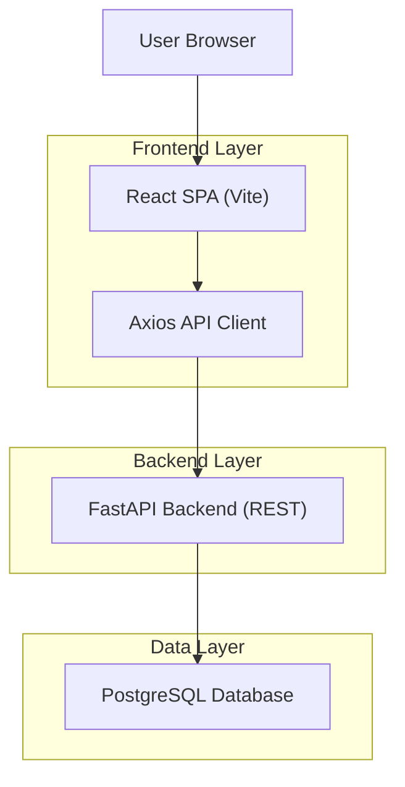
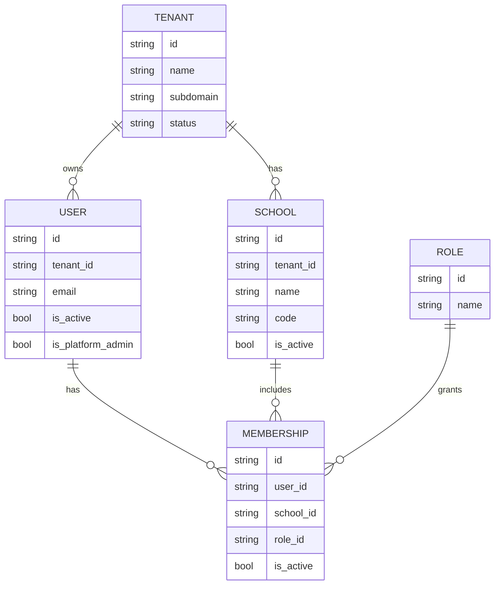

## 1.Architecture design


Key behavior:
- Multi-tenant context is derived from hostname/subdomain on the backend.
- Auth uses access token (client storage) + httpOnly refresh cookie; frontend restores session on load.

## 2.Technology Description
- Frontend: React@19 + react-router-dom@7 + Redux Toolkit + MUI + Vite + TypeScript
- Backend: FastAPI@0.115 + SQLAlchemy@2 + Alembic
- Database: PostgreSQL

## 3.Route definitions
| Route | Purpose |
|-------|---------|
| / | Public anonymous landing page (marketing + CTA to sign in). |
| /login | Email/password login; redirects by role. |
| /app | Tenant Admin Panel shell (authenticated, tenant users only). |
| /app/dashboard | Tenant dashboard (home). |
| /app/academic | Academic module workspace. |
| /app/students | Students module workspace. |
| /app/staff | Staff module workspace. |
| /app/users | Users module workspace. |
| /app/exams | Exams module workspace. |
| /app/events | Events & notices workspace. |
| /app/finance | Finance workspace. |
| /app/logistics | Logistics workspace. |
| /app/settings | Tenant settings workspace. |
| /app/settings/users | System users management. |
| /saas-admin | Platform Admin panel (authenticated, platform admins only). |

## 4.API definitions
### 4.1 Auth
- POST /api/v1/auth/login
- POST /api/v1/auth/logout
- POST /api/v1/auth/refresh
- GET /api/v1/auth/me

Shared types (conceptual):
```ts
type Membership = { school_id: string; role_id: string; school_name: string };

type MeResponse = {
  user_id: string;
  email: string;
  tenant_id: string | null;
  is_platform_admin: boolean;
  memberships: Membership[];
};
```

### 4.2 Platform admin (SaaS)
- GET /api/v1/platform/tenants
- POST /api/v1/platform/tenants (provision tenant)
- PATCH /api/v1/platform/tenants/{tenantId}/status
- POST /api/v1/platform/tenants/reset-admin-password

## 6.Data model
### 6.1 Data model definition


### 6.2 Data Definition Language
See existing Alembic migrations for full schema (tenancy + modules).