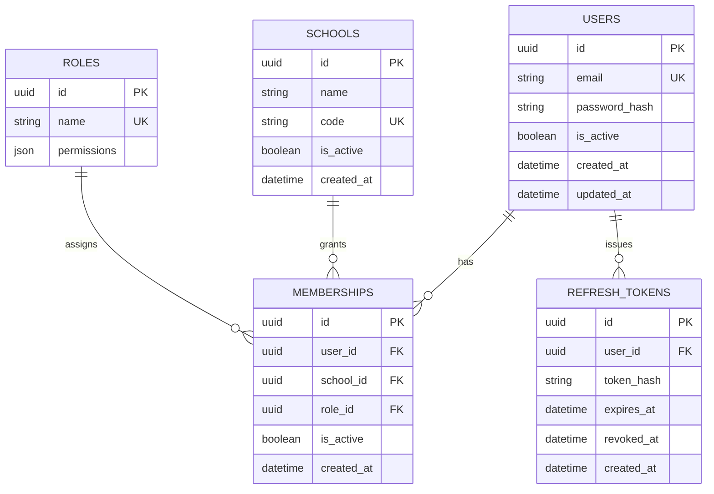
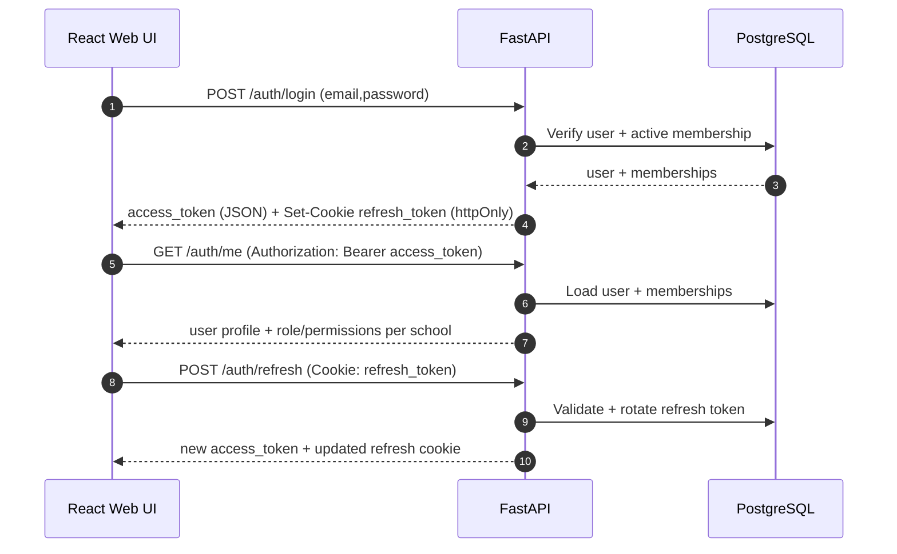

# School Management System - Complete Architecture Document

## Executive Summary

This document outlines a comprehensive, production-ready School Management System (SMS) architecture designed for scalability, maintainability, and ease of use. The system follows industry best practices with a modular approach, targeting **30-35 core features** across three implementation levels.

**Implementation Baseline (this repository):** FastAPI (REST API) + React (TypeScript) frontend, designed to keep a clean path to a future React Native mobile app.

## Repository Implementation Status (FastAPI + React)

This section reflects what is currently implemented in this repository.

- **Identifiers**: API and DB primary keys are UUIDs (not auto-increment integers).
- **Auth**: JWT access tokens + refresh tokens via httpOnly cookie rotation.
- **Multi-school**: Requests are scoped by `X-School-Id` (membership-based RBAC).
- **Backend modules implemented**: Academics, Attendance, Leaves, Timetable, Exams/Results/Grades, Fees/Discounts, Communication (notices/notifications/messages/logs), Library, Transport, Reports/Analytics, Documents, Certificates, Events/Holidays, Settings, Audit Logs (read), Backup metadata, Batch operations.
- **Frontend implemented**: Login + token refresh, school selector, basic dashboard, users list.

---

## Table of Contents

1. [System Overview](#1-system-overview)
2. [Architecture Design](#2-architecture-design)
3. [Technology Stack](#3-technology-stack)
4. [Database Design](#4-database-design)
5. [Module Breakdown](#5-module-breakdown)
6. [Feature Implementation Plan](#6-feature-implementation-plan)
7. [Security Architecture](#7-security-architecture)
8. [API Design](#8-api-design)
9. [Deployment Strategy](#9-deployment-strategy)
10. [Testing Strategy](#10-testing-strategy)
11. [Maintenance & Support](#11-maintenance--support)

---

## 1. System Overview

### 1.1 Purpose

A web-based School Management System to digitize and streamline daily school operations including academic management, attendance tracking, examination management, fee collection, and communication.

### 1.2 Target Users

- **Super Admin**: System owner, multi-school management
- **School Admin**: Principal/headmaster with full school access
- **Teachers**: Academic and classroom management
- **Students**: Access to academics, attendance, results
- **Parents**: Monitor child's progress and communication
- **Accountant**: Financial operations
- **Librarian**: Library management
- **Transport Manager**: Transport operations

### 1.3 System Goals

- Replace manual paper-based processes
- Centralize school data management
- Enable real-time communication
- Generate automated reports
- Provide role-based secure access
- Support mobile-first responsive design

---

## 2. Architecture Design

### 2.1 Architecture Pattern

**Three-Tier Architecture** with microservices approach for scalability.

```
┌─────────────────────────────────────────────────┐
│           PRESENTATION LAYER                     │
│  (React/Vue.js + Mobile Apps - Flutter/React Native) │
└─────────────────────────────────────────────────┘
                      ↓
┌─────────────────────────────────────────────────┐
│           APPLICATION LAYER                      │
│  (FastAPI REST API + WebSocket)                 │
└─────────────────────────────────────────────────┘
                      ↓
┌─────────────────────────────────────────────────┐
│              DATA LAYER                          │
│  (PostgreSQL/MySQL + Redis + File Storage)      │
└─────────────────────────────────────────────────┘
```

### 2.2 System Architecture Diagram

```
┌──────────────┐     ┌──────────────┐     ┌──────────────┐
│   Web App    │     │  Mobile App  │     │  Admin Panel │
│  (React.js)  │     │  (Flutter)   │     │   (React)    │
└──────┬───────┘     └──────┬───────┘     └──────┬───────┘
       │                    │                    │
       └────────────────────┼────────────────────┘
                            │
                    ┌───────▼────────┐
                    │   API Gateway  │
                    │  (Load Balancer)│
                    └───────┬────────┘
                            │
       ┌────────────────────┼────────────────────┐
       │                    │                    │
┌──────▼──────┐    ┌────────▼───────┐   ┌───────▼──────┐
│   Auth      │    │   Academic     │   │   Finance    │
│  Service    │    │   Service      │   │   Service    │
└──────┬──────┘    └────────┬───────┘   └───────┬──────┘
       │                    │                    │
       └────────────────────┼────────────────────┘
                            │
              ┌─────────────┼─────────────┐
              │             │             │
       ┌──────▼──────┐  ┌──▼───┐  ┌─────▼─────┐
       │  PostgreSQL │  │Redis │  │   S3/Blob │
       │  (Primary)  │  │Cache │  │  Storage  │
       └─────────────┘  └──────┘  └───────────┘
```

### 2.3 Design Patterns Used

- **MVC (Model-View-Controller)**: For application structure
- **Repository Pattern**: For data access abstraction
- **Factory Pattern**: For object creation
- **Observer Pattern**: For event-driven notifications
- **Singleton Pattern**: For configuration management
- **Strategy Pattern**: For payment gateway integration

---

## 3. Technology Stack

### 3.1 Recommended Stack (Modern & Scalable)

#### Frontend

- **Framework**: React.js 18+ with TypeScript
- **State Management**: Redux Toolkit / Zustand
- **UI Library**: Material-UI (MUI) / Ant Design
- **Styling**: Tailwind CSS + CSS Modules
- **Form Handling**: React Hook Form + Zod validation
- **Charts**: Recharts / ApexCharts
- **HTTP Client**: Axios with interceptors

#### Backend

- **Framework**: FastAPI (Python) with Pydantic validation
- **Server**: Uvicorn (dev) + Gunicorn/Uvicorn workers (prod)
- **DB ORM**: SQLAlchemy 2.0
- **Migrations**: Alembic
- **Auth**: JWT access tokens + refresh tokens, RBAC authorization
- **Background Jobs (future)**: Celery/RQ + Redis
- **Real-time (future)**: WebSocket (FastAPI) for notifications
- **Email/SMS (future)**: Provider adapters (SendGrid/Twilio/AWS SNS)

#### Database

- **Primary Database**: PostgreSQL 15+ (or MySQL 8+)
- **Caching**: Redis 7+
- **Search Engine**: Elasticsearch (optional for large scale)
- **File Storage**: AWS S3 / Azure Blob / MinIO (self-hosted)

#### Mobile

- **Framework**: Flutter (Dart) or React Native
- **State Management**: Riverpod (Flutter) / Redux (RN)

#### DevOps & Infrastructure

- **Containerization**: Docker + Docker Compose
- **Orchestration**: Kubernetes (for large scale)
- **CI/CD**: GitHub Actions / GitLab CI / Jenkins
- **Cloud Provider**: AWS / Azure / DigitalOcean
- **Web Server**: Nginx (reverse proxy + load balancer)
- **Monitoring**: Prometheus + Grafana / New Relic
- **Logging**: ELK Stack (Elasticsearch, Logstash, Kibana)

#### Security

- **Authentication**: JWT (access) + refresh token rotation
- **Authorization**: RBAC (Role-Based Access Control)
- **Encryption**: bcrypt (passwords), AES-256 (data)
- **API Security**: Rate limiting, CORS, security headers middleware
- **SSL/TLS**: Let's Encrypt (free) or commercial certificate

---

## 4. Database Design

### 4.1 Core Database Schema

#### Users & Authentication

```sql
-- Users table (central authentication)
CREATE TABLE users (
    id SERIAL PRIMARY KEY,
    email VARCHAR(255) UNIQUE NOT NULL,
    password_hash VARCHAR(255) NOT NULL,
    role_id INTEGER REFERENCES roles(id),
    is_active BOOLEAN DEFAULT true,
    email_verified BOOLEAN DEFAULT false,
    last_login TIMESTAMP,
    created_at TIMESTAMP DEFAULT NOW(),
    updated_at TIMESTAMP DEFAULT NOW()
);

-- Roles table
CREATE TABLE roles (
    id SERIAL PRIMARY KEY,
    name VARCHAR(50) UNIQUE NOT NULL, -- admin, teacher, student, parent
    description TEXT,
    permissions JSONB, -- flexible permission storage
    created_at TIMESTAMP DEFAULT NOW()
);

-- Sessions table (optional, for session management)
CREATE TABLE sessions (
    id SERIAL PRIMARY KEY,
    user_id INTEGER REFERENCES users(id) ON DELETE CASCADE,
    token VARCHAR(500) UNIQUE NOT NULL,
    expires_at TIMESTAMP NOT NULL,
    created_at TIMESTAMP DEFAULT NOW()
);
```

#### Academic Structure

```sql
-- Schools table (for multi-school support)
CREATE TABLE schools (
    id SERIAL PRIMARY KEY,
    name VARCHAR(255) NOT NULL,
    code VARCHAR(50) UNIQUE,
    address TEXT,
    phone VARCHAR(20),
    email VARCHAR(255),
    logo_url VARCHAR(500),
    is_active BOOLEAN DEFAULT true,
    created_at TIMESTAMP DEFAULT NOW()
);

-- Academic years
CREATE TABLE academic_years (
    id SERIAL PRIMARY KEY,
    school_id INTEGER REFERENCES schools(id),
    name VARCHAR(100) NOT NULL, -- "2024-2025"
    start_date DATE NOT NULL,
    end_date DATE NOT NULL,
    is_current BOOLEAN DEFAULT false,
    created_at TIMESTAMP DEFAULT NOW()
);

-- Classes/Grades
CREATE TABLE classes (
    id SERIAL PRIMARY KEY,
    school_id INTEGER REFERENCES schools(id),
    name VARCHAR(100) NOT NULL, -- "Class 1", "Grade 5"
    numeric_value INTEGER, -- 1, 2, 3... for sorting
    created_at TIMESTAMP DEFAULT NOW()
);

-- Sections
CREATE TABLE sections (
    id SERIAL PRIMARY KEY,
    class_id INTEGER REFERENCES classes(id) ON DELETE CASCADE,
    name VARCHAR(50) NOT NULL, -- "A", "B", "C"
    capacity INTEGER DEFAULT 40,
    room_number VARCHAR(50),
    created_at TIMESTAMP DEFAULT NOW(),
    UNIQUE(class_id, name)
);

-- Subjects
CREATE TABLE subjects (
    id SERIAL PRIMARY KEY,
    school_id INTEGER REFERENCES schools(id),
    name VARCHAR(100) NOT NULL,
    code VARCHAR(50),
    description TEXT,
    is_elective BOOLEAN DEFAULT false,
    created_at TIMESTAMP DEFAULT NOW()
);

-- Class-Subject mapping
CREATE TABLE class_subjects (
    id SERIAL PRIMARY KEY,
    class_id INTEGER REFERENCES classes(id),
    subject_id INTEGER REFERENCES subjects(id),
    is_mandatory BOOLEAN DEFAULT true,
    created_at TIMESTAMP DEFAULT NOW(),
    UNIQUE(class_id, subject_id)
);
```

#### Student Management

```sql
-- Students
CREATE TABLE students (
    id SERIAL PRIMARY KEY,
    user_id INTEGER REFERENCES users(id) ON DELETE CASCADE,
    school_id INTEGER REFERENCES schools(id),
    admission_number VARCHAR(100) UNIQUE NOT NULL,
    first_name VARCHAR(100) NOT NULL,
    last_name VARCHAR(100) NOT NULL,
    date_of_birth DATE NOT NULL,
    gender VARCHAR(20),
    blood_group VARCHAR(10),
    photo_url VARCHAR(500),
    address TEXT,
    city VARCHAR(100),
    state VARCHAR(100),
    postal_code VARCHAR(20),
    country VARCHAR(100),
    admission_date DATE NOT NULL,
    status VARCHAR(50) DEFAULT 'active', -- active, graduated, suspended
    created_at TIMESTAMP DEFAULT NOW(),
    updated_at TIMESTAMP DEFAULT NOW()
);

-- Student enrollment (class assignment per year)
CREATE TABLE student_enrollments (
    id SERIAL PRIMARY KEY,
    student_id INTEGER REFERENCES students(id) ON DELETE CASCADE,
    academic_year_id INTEGER REFERENCES academic_years(id),
    section_id INTEGER REFERENCES sections(id),
    roll_number VARCHAR(50),
    enrollment_date DATE DEFAULT CURRENT_DATE,
    status VARCHAR(50) DEFAULT 'active', -- active, promoted, detained
    created_at TIMESTAMP DEFAULT NOW(),
    UNIQUE(student_id, academic_year_id)
);

-- Parents/Guardians
CREATE TABLE guardians (
    id SERIAL PRIMARY KEY,
    user_id INTEGER REFERENCES users(id) ON DELETE CASCADE,
    first_name VARCHAR(100) NOT NULL,
    last_name VARCHAR(100) NOT NULL,
    relation VARCHAR(50), -- father, mother, guardian
    phone VARCHAR(20) NOT NULL,
    email VARCHAR(255),
    occupation VARCHAR(100),
    address TEXT,
    photo_url VARCHAR(500),
    created_at TIMESTAMP DEFAULT NOW()
);

-- Student-Guardian relationship
CREATE TABLE student_guardians (
    id SERIAL PRIMARY KEY,
    student_id INTEGER REFERENCES students(id) ON DELETE CASCADE,
    guardian_id INTEGER REFERENCES guardians(id) ON DELETE CASCADE,
    is_primary BOOLEAN DEFAULT false,
    created_at TIMESTAMP DEFAULT NOW(),
    UNIQUE(student_id, guardian_id)
);
```

#### Staff Management

```sql
-- Teachers/Staff
CREATE TABLE staff (
    id SERIAL PRIMARY KEY,
    user_id INTEGER REFERENCES users(id) ON DELETE CASCADE,
    school_id INTEGER REFERENCES schools(id),
    employee_id VARCHAR(100) UNIQUE NOT NULL,
    first_name VARCHAR(100) NOT NULL,
    last_name VARCHAR(100) NOT NULL,
    date_of_birth DATE,
    gender VARCHAR(20),
    phone VARCHAR(20) NOT NULL,
    email VARCHAR(255) NOT NULL,
    address TEXT,
    qualification VARCHAR(255),
    designation VARCHAR(100), -- teacher, principal, accountant
    department VARCHAR(100),
    date_of_joining DATE NOT NULL,
    salary DECIMAL(10,2),
    photo_url VARCHAR(500),
    status VARCHAR(50) DEFAULT 'active', -- active, resigned, retired
    created_at TIMESTAMP DEFAULT NOW(),
    updated_at TIMESTAMP DEFAULT NOW()
);

-- Teacher-Subject assignment
CREATE TABLE teacher_assignments (
    id SERIAL PRIMARY KEY,
    staff_id INTEGER REFERENCES staff(id) ON DELETE CASCADE,
    section_id INTEGER REFERENCES sections(id),
    subject_id INTEGER REFERENCES subjects(id),
    academic_year_id INTEGER REFERENCES academic_years(id),
    is_class_teacher BOOLEAN DEFAULT false,
    created_at TIMESTAMP DEFAULT NOW(),
    UNIQUE(section_id, subject_id, academic_year_id)
);
```

#### Attendance Management

```sql
-- Student attendance
CREATE TABLE student_attendance (
    id SERIAL PRIMARY KEY,
    student_id INTEGER REFERENCES students(id) ON DELETE CASCADE,
    date DATE NOT NULL,
    status VARCHAR(20) NOT NULL, -- present, absent, late, half-day, sick-leave
    remarks TEXT,
    marked_by INTEGER REFERENCES users(id),
    created_at TIMESTAMP DEFAULT NOW(),
    UNIQUE(student_id, date)
);

-- Staff attendance
CREATE TABLE staff_attendance (
    id SERIAL PRIMARY KEY,
    staff_id INTEGER REFERENCES staff(id) ON DELETE CASCADE,
    date DATE NOT NULL,
    check_in_time TIME,
    check_out_time TIME,
    status VARCHAR(20) NOT NULL, -- present, absent, half-day, on-leave
    remarks TEXT,
    created_at TIMESTAMP DEFAULT NOW(),
    UNIQUE(staff_id, date)
);
```

#### Examination & Results

```sql
-- Exams
CREATE TABLE exams (
    id SERIAL PRIMARY KEY,
    school_id INTEGER REFERENCES schools(id),
    academic_year_id INTEGER REFERENCES academic_years(id),
    name VARCHAR(255) NOT NULL, -- "Mid-term Exam", "Final Exam"
    exam_type VARCHAR(50), -- mid-term, final, unit-test
    start_date DATE NOT NULL,
    end_date DATE NOT NULL,
    created_at TIMESTAMP DEFAULT NOW()
);

-- Exam schedule
CREATE TABLE exam_schedules (
    id SERIAL PRIMARY KEY,
    exam_id INTEGER REFERENCES exams(id) ON DELETE CASCADE,
    class_id INTEGER REFERENCES classes(id),
    subject_id INTEGER REFERENCES subjects(id),
    exam_date DATE NOT NULL,
    start_time TIME NOT NULL,
    end_time TIME NOT NULL,
    max_marks INTEGER NOT NULL,
    pass_marks INTEGER NOT NULL,
    room_number VARCHAR(50),
    created_at TIMESTAMP DEFAULT NOW()
);

-- Marks entry
CREATE TABLE marks (
    id SERIAL PRIMARY KEY,
    exam_schedule_id INTEGER REFERENCES exam_schedules(id) ON DELETE CASCADE,
    student_id INTEGER REFERENCES students(id) ON DELETE CASCADE,
    marks_obtained DECIMAL(5,2),
    is_absent BOOLEAN DEFAULT false,
    remarks TEXT,
    entered_by INTEGER REFERENCES users(id),
    created_at TIMESTAMP DEFAULT NOW(),
    updated_at TIMESTAMP DEFAULT NOW(),
    UNIQUE(exam_schedule_id, student_id)
);

-- Grade system
CREATE TABLE grade_system (
    id SERIAL PRIMARY KEY,
    school_id INTEGER REFERENCES schools(id),
    name VARCHAR(50) NOT NULL, -- "A+", "A", "B"
    min_percentage DECIMAL(5,2) NOT NULL,
    max_percentage DECIMAL(5,2) NOT NULL,
    grade_point DECIMAL(3,2),
    remarks VARCHAR(100),
    created_at TIMESTAMP DEFAULT NOW()
);
```

#### Fee Management

```sql
-- Fee structures
CREATE TABLE fee_structures (
    id SERIAL PRIMARY KEY,
    school_id INTEGER REFERENCES schools(id),
    academic_year_id INTEGER REFERENCES academic_years(id),
    class_id INTEGER REFERENCES classes(id),
    name VARCHAR(255) NOT NULL, -- "Tuition Fee", "Transport Fee"
    amount DECIMAL(10,2) NOT NULL,
    due_date DATE,
    is_mandatory BOOLEAN DEFAULT true,
    created_at TIMESTAMP DEFAULT NOW()
);

-- Fee payments
CREATE TABLE fee_payments (
    id SERIAL PRIMARY KEY,
    student_id INTEGER REFERENCES students(id) ON DELETE CASCADE,
    fee_structure_id INTEGER REFERENCES fee_structures(id),
    amount_paid DECIMAL(10,2) NOT NULL,
    payment_date DATE DEFAULT CURRENT_DATE,
    payment_method VARCHAR(50), -- cash, card, online, cheque
    transaction_id VARCHAR(255),
    receipt_number VARCHAR(100) UNIQUE,
    remarks TEXT,
    collected_by INTEGER REFERENCES users(id),
    status VARCHAR(50) DEFAULT 'completed', -- pending, completed, refunded
    created_at TIMESTAMP DEFAULT NOW()
);

-- Fee dues
CREATE TABLE fee_dues (
    id SERIAL PRIMARY KEY,
    student_id INTEGER REFERENCES students(id) ON DELETE CASCADE,
    fee_structure_id INTEGER REFERENCES fee_structures(id),
    total_amount DECIMAL(10,2) NOT NULL,
    paid_amount DECIMAL(10,2) DEFAULT 0,
    due_amount DECIMAL(10,2) NOT NULL,
    fine_amount DECIMAL(10,2) DEFAULT 0,
    status VARCHAR(50) DEFAULT 'unpaid', -- paid, partial, unpaid
    created_at TIMESTAMP DEFAULT NOW(),
    updated_at TIMESTAMP DEFAULT NOW()
);
```

#### Communication

```sql
-- Notices/Announcements
CREATE TABLE notices (
    id SERIAL PRIMARY KEY,
    school_id INTEGER REFERENCES schools(id),
    title VARCHAR(255) NOT NULL,
    content TEXT NOT NULL,
    notice_type VARCHAR(50), -- general, urgent, holiday, event
    target_audience VARCHAR(50), -- all, students, parents, staff
    attachment_url VARCHAR(500),
    publish_date DATE DEFAULT CURRENT_DATE,
    expiry_date DATE,
    is_published BOOLEAN DEFAULT false,
    created_by INTEGER REFERENCES users(id),
    created_at TIMESTAMP DEFAULT NOW()
);

-- Messages/Notifications
CREATE TABLE notifications (
    id SERIAL PRIMARY KEY,
    user_id INTEGER REFERENCES users(id) ON DELETE CASCADE,
    title VARCHAR(255) NOT NULL,
    message TEXT NOT NULL,
    notification_type VARCHAR(50), -- info, warning, success, error
    is_read BOOLEAN DEFAULT false,
    read_at TIMESTAMP,
    created_at TIMESTAMP DEFAULT NOW()
);

-- SMS/Email logs
CREATE TABLE communication_logs (
    id SERIAL PRIMARY KEY,
    user_id INTEGER REFERENCES users(id),
    communication_type VARCHAR(20), -- sms, email
    recipient VARCHAR(255) NOT NULL,
    subject VARCHAR(255),
    content TEXT NOT NULL,
    status VARCHAR(50), -- sent, failed, pending
    sent_at TIMESTAMP,
    created_at TIMESTAMP DEFAULT NOW()
);
```

#### Timetable Management

```sql
-- Time slots
CREATE TABLE time_slots (
    id SERIAL PRIMARY KEY,
    school_id INTEGER REFERENCES schools(id),
    name VARCHAR(100) NOT NULL, -- "Period 1", "Break"
    start_time TIME NOT NULL,
    end_time TIME NOT NULL,
    slot_order INTEGER NOT NULL,
    is_break BOOLEAN DEFAULT false,
    created_at TIMESTAMP DEFAULT NOW()
);

-- Timetable
CREATE TABLE timetable (
    id SERIAL PRIMARY KEY,
    section_id INTEGER REFERENCES sections(id) ON DELETE CASCADE,
    subject_id INTEGER REFERENCES subjects(id),
    staff_id INTEGER REFERENCES staff(id),
    time_slot_id INTEGER REFERENCES time_slots(id),
    day_of_week INTEGER NOT NULL, -- 1=Monday, 7=Sunday
    room_number VARCHAR(50),
    academic_year_id INTEGER REFERENCES academic_years(id),
    created_at TIMESTAMP DEFAULT NOW(),
    UNIQUE(section_id, day_of_week, time_slot_id, academic_year_id)
);
```

#### Library Management

```sql
-- Books
CREATE TABLE books (
    id SERIAL PRIMARY KEY,
    school_id INTEGER REFERENCES schools(id),
    title VARCHAR(255) NOT NULL,
    author VARCHAR(255),
    isbn VARCHAR(50) UNIQUE,
    publisher VARCHAR(255),
    publication_year INTEGER,
    category VARCHAR(100),
    total_copies INTEGER DEFAULT 1,
    available_copies INTEGER DEFAULT 1,
    shelf_location VARCHAR(100),
    book_cover_url VARCHAR(500),
    created_at TIMESTAMP DEFAULT NOW()
);

-- Book issues
CREATE TABLE book_issues (
    id SERIAL PRIMARY KEY,
    book_id INTEGER REFERENCES books(id) ON DELETE CASCADE,
    user_id INTEGER REFERENCES users(id), -- student or staff
    issue_date DATE DEFAULT CURRENT_DATE,
    due_date DATE NOT NULL,
    return_date DATE,
    fine_amount DECIMAL(10,2) DEFAULT 0,
    status VARCHAR(50) DEFAULT 'issued', -- issued, returned, lost
    issued_by INTEGER REFERENCES users(id),
    created_at TIMESTAMP DEFAULT NOW()
);
```

#### Transport Management

```sql
-- Vehicles
CREATE TABLE vehicles (
    id SERIAL PRIMARY KEY,
    school_id INTEGER REFERENCES schools(id),
    vehicle_number VARCHAR(50) UNIQUE NOT NULL,
    vehicle_type VARCHAR(50), -- bus, van
    capacity INTEGER NOT NULL,
    driver_name VARCHAR(255),
    driver_phone VARCHAR(20),
    driver_license VARCHAR(100),
    insurance_expiry DATE,
    fitness_expiry DATE,
    status VARCHAR(50) DEFAULT 'active', -- active, maintenance, inactive
    created_at TIMESTAMP DEFAULT NOW()
);

-- Routes
CREATE TABLE routes (
    id SERIAL PRIMARY KEY,
    school_id INTEGER REFERENCES schools(id),
    route_name VARCHAR(255) NOT NULL,
    route_code VARCHAR(50),
    fare DECIMAL(10,2),
    created_at TIMESTAMP DEFAULT NOW()
);

-- Route stops
CREATE TABLE route_stops (
    id SERIAL PRIMARY KEY,
    route_id INTEGER REFERENCES routes(id) ON DELETE CASCADE,
    stop_name VARCHAR(255) NOT NULL,
    stop_order INTEGER NOT NULL,
    pickup_time TIME,
    drop_time TIME,
    created_at TIMESTAMP DEFAULT NOW()
);

-- Student transport assignment
CREATE TABLE student_transport (
    id SERIAL PRIMARY KEY,
    student_id INTEGER REFERENCES students(id) ON DELETE CASCADE,
    route_id INTEGER REFERENCES routes(id),
    vehicle_id INTEGER REFERENCES vehicles(id),
    pickup_stop_id INTEGER REFERENCES route_stops(id),
    drop_stop_id INTEGER REFERENCES route_stops(id),
    academic_year_id INTEGER REFERENCES academic_years(id),
    is_active BOOLEAN DEFAULT true,
    created_at TIMESTAMP DEFAULT NOW()
);
```

### 4.2 Database Indexes (Performance Optimization)

```sql
-- User authentication indexes
CREATE INDEX idx_users_email ON users(email);
CREATE INDEX idx_users_role ON users(role_id);

-- Academic indexes
CREATE INDEX idx_students_admission ON students(admission_number);
CREATE INDEX idx_students_school ON students(school_id);
CREATE INDEX idx_enrollments_student ON student_enrollments(student_id);
CREATE INDEX idx_enrollments_year ON student_enrollments(academic_year_id);

-- Attendance indexes
CREATE INDEX idx_attendance_student_date ON student_attendance(student_id, date);
CREATE INDEX idx_attendance_date ON student_attendance(date);

-- Marks indexes
CREATE INDEX idx_marks_student ON marks(student_id);
CREATE INDEX idx_marks_exam ON marks(exam_schedule_id);

-- Fee indexes
CREATE INDEX idx_payments_student ON fee_payments(student_id);
CREATE INDEX idx_payments_date ON fee_payments(payment_date);

-- Communication indexes
CREATE INDEX idx_notifications_user ON notifications(user_id, is_read);
CREATE INDEX idx_notices_school ON notices(school_id, publish_date);
```

---

## 5. Module Breakdown

### 5.1 Authentication & Authorization Module

**Responsibilities:**

- User login/logout
- Password reset & recovery
- JWT token generation & validation
- Role-based access control (RBAC)
- Session management
- Audit logging

**Key APIs:**

```
POST /api/auth/login
POST /api/auth/logout
POST /api/auth/register
POST /api/auth/forgot-password
POST /api/auth/reset-password
POST /api/auth/change-password
GET  /api/auth/verify-token
GET  /api/auth/profile
```

**Security Features:**

- Password hashing with bcrypt (10+ rounds)
- JWT with refresh token mechanism
- Rate limiting (5 failed attempts = temporary block)
- IP-based login monitoring
- Two-factor authentication (2FA) - optional

---

### 5.2 Dashboard Module

**Responsibilities:**

- Role-specific dashboard views
- Key metrics & statistics
- Quick action buttons
- Recent activity feed
- Announcements widget

**Dashboard Views by Role:**

**Admin Dashboard:**

- Total students, staff, classes
- Today's attendance summary
- Fee collection summary
- Upcoming exams
- Recent notices
- Pending approvals

**Teacher Dashboard:**

- My classes & subjects
- Today's timetable
- Attendance marking shortcuts
- Pending mark entries
- My students list
- Class performance summary

**Student Dashboard:**

- My attendance percentage
- Upcoming exams
- Latest marks/results
- Fee due status
- Timetable
- Notices & announcements

**Parent Dashboard:**

- Children's attendance
- Academic progress
- Fee payment status
- Timetable
- Communication from school
- Upcoming events

---

### 5.3 Student Management Module

**Responsibilities:**

- Student registration & admission
- Profile management
- Document uploads (birth certificate, ID, photos)
- Promotion & section assignment
- Student search & filtering
- Bulk import/export (Excel/CSV)

**Key APIs:**

```
GET    /api/students (list with pagination)
GET    /api/students/:id
POST   /api/students (create)
PUT    /api/students/:id (update)
DELETE /api/students/:id
POST   /api/students/bulk-import
GET    /api/students/export (Excel/PDF)
GET    /api/students/:id/attendance
GET    /api/students/:id/marks
GET    /api/students/:id/fee-status
```

**Features:**

- Advanced search (by name, admission number, class)
- Filters (class, section, status, gender)
- Student ID card generation
- Student history tracking
- Bulk operations (promote, transfer)

---

### 5.4 Academic Management Module

**Responsibilities:**

- Class & section management
- Subject management
- Curriculum setup
- Academic calendar
- Teacher assignment
- Timetable generation

**Key APIs:**

```
# Classes
GET    /api/classes
POST   /api/classes
PUT    /api/classes/:id
DELETE /api/classes/:id

# Sections
GET    /api/sections
POST   /api/sections
GET    /api/sections/:id/students

# Subjects
GET    /api/subjects
POST   /api/subjects
PUT    /api/subjects/:id

# Timetable
GET    /api/timetable/:sectionId
POST   /api/timetable
PUT    /api/timetable/:id
GET    /api/timetable/teacher/:teacherId
```

**Features:**

- Drag-and-drop timetable builder
- Conflict detection (teacher, room)
- Template-based timetable
- Print/export timetable (PDF)

---

### 5.5 Attendance Management Module

**Responsibilities:**

- Daily attendance marking
- Bulk attendance entry
- Attendance reports
- Leave management
- Attendance alerts

**Key APIs:**

```
# Student Attendance
POST   /api/attendance/students/mark
GET    /api/attendance/students/date/:date
GET    /api/attendance/students/report (by date range)
GET    /api/attendance/students/:studentId/summary

# Staff Attendance
POST   /api/attendance/staff/mark
GET    /api/attendance/staff/date/:date
GET    /api/attendance/staff/report

# Leave Management
POST   /api/leaves/apply
GET    /api/leaves/pending
PUT    /api/leaves/:id/approve
```

**Features:**

- Quick attendance marking interface
- Absentee SMS/email alerts
- Monthly attendance reports
- Attendance percentage calculation
- Holiday calendar integration
- Late arrival tracking

---

### 5.6 Examination & Results Module

**Responsibilities:**

- Exam creation & scheduling
- Marks entry
- Grade calculation
- Report card generation
- Result analysis

**Key APIs:**

```
# Exams
GET    /api/exams
POST   /api/exams (create exam)
GET    /api/exams/:id
PUT    /api/exams/:id

# Marks Entry
POST   /api/marks/enter
GET    /api/marks/exam/:examId/class/:classId
PUT    /api/marks/:id

# Results
GET    /api/results/student/:studentId/exam/:examId
GET    /api/results/class/:classId/exam/:examId
POST   /api/results/publish
GET    /api/results/:studentId/report-card (PDF)
```

**Features:**

- Grade system configuration
- Marks validation rules
- Rank calculation
- Subject-wise analysis
- Class performance comparison
- Report card templates
- Result publication workflow

---

### 5.7 Fee Management Module

**Responsibilities:**

- Fee structure setup
- Fee collection
- Receipt generation
- Due tracking
- Fine calculation
- Payment reports

**Key APIs:**

```
# Fee Structure
GET    /api/fees/structures
POST   /api/fees/structures
GET    /api/fees/structures/:classId

# Payment
POST   /api/fees/collect
GET    /api/fees/student/:studentId
GET    /api/fees/receipt/:id (PDF)
GET    /api/fees/dues
GET    /api/fees/reports/collection (by date range)

# Reminders
POST   /api/fees/send-reminders
```

**Features:**

- Multiple fee types (tuition, transport, hostel)
- Installment support
- Late fee/fine automation
- Payment history
- Discount/scholarship management
- SMS/email reminders
- Collection reports (daily, monthly)

---

### 5.8 Communication Module

**Responsibilities:**

- Notice board management
- SMS/Email notifications
- In-app messaging
- Event management
- Parent-teacher communication

**Key APIs:**

```
# Notices
GET    /api/notices
POST   /api/notices (create)
PUT    /api/notices/:id
DELETE /api/notices/:id
GET    /api/notices/active

# Notifications
GET    /api/notifications/my
POST   /api/notifications/send
PUT    /api/notifications/:id/read

# Messaging
POST   /api/messages/send
GET    /api/messages/conversations
GET    /api/messages/thread/:id
```

**Features:**

- Targeted messaging (class, role, individual)
- Scheduled notifications
- Push notifications (mobile)
- Email templates
- SMS templates
- Delivery tracking
- Read receipts

---

### 5.9 Library Management Module

**Responsibilities:**

- Book inventory
- Issue/return tracking
- Fine calculation
- Book search
- Reports

**Key APIs:**

```
GET    /api/library/books
POST   /api/library/books
PUT    /api/library/books/:id
POST   /api/library/issue
POST   /api/library/return
GET    /api/library/issued
GET    /api/library/overdue
```

**Features:**

- Barcode/QR code scanning
- Book reservation
- Fine automation
- Library card generation
- Reading history
- Popular books tracking

---

### 5.10 Transport Management Module

**Responsibilities:**

- Vehicle management
- Route planning
- Student transport assignment
- GPS tracking integration (optional)
- Transport fee management

**Key APIs:**

```
GET    /api/transport/vehicles
POST   /api/transport/vehicles
GET    /api/transport/routes
POST   /api/transport/routes
GET    /api/transport/students/:vehicleId
POST   /api/transport/assign
```

**Features:**

- Route optimization
- Driver management
- Vehicle maintenance tracking
- Transport attendance
- Parent tracking app integration

---

### 5.11 Reports & Analytics Module

**Responsibilities:**

- Predefined reports
- Custom report builder
- Data visualization
- Export functionality
- Analytics dashboard

**Report Categories:**

1. **Attendance Reports**

   - Daily attendance summary
   - Monthly attendance register
   - Defaulter list
   - Class-wise attendance percentage

2. **Academic Reports**

   - Exam result analysis
   - Subject-wise performance
   - Topper list
   - Progress reports

3. **Financial Reports**

   - Fee collection summary
   - Due list
   - Payment history
   - Class-wise collection

4. **Administrative Reports**
   - Student strength
   - Staff directory
   - Certificate generation

**Key APIs:**

```
GET    /api/reports/attendance
GET    /api/reports/academic
GET    /api/reports/financial
GET    /api/reports/custom
POST   /api/reports/generate
```

---

## 6. Feature Implementation Plan

### Phase 1: Foundation (Weeks 1-4) - MVP

**Goal:** Basic working system with core features

**Features:**

1. Authentication & user management
2. Role-based dashboards
3. Student management (CRUD)
4. Class & section management
5. Basic attendance (manual entry)
6. Simple notice board

**Deliverable:** Admin can add students, mark attendance, post notices

---

### Phase 2: Academic Core (Weeks 5-8)

**Goal:** Complete academic management

**Features:**

1. Subject management
2. Teacher assignment
3. Timetable module
4. Exam creation
5. Marks entry
6. Result generation
7. Report cards

**Deliverable:** Full academic workflow operational

---

### Phase 3: Finance & Communication (Weeks 9-11)

**Goal:** Fee management and communication

**Features:**

1. Fee structure setup
2. Payment collection
3. Receipt generation
4. SMS/Email integration
5. Notifications system
6. Parent portal

**Deliverable:** Complete fee workflow + communication

---

### Phase 4: Advanced Features (Weeks 12-14)

**Goal:** Additional modules

**Features:**

1. Library management
2. Transport management
3. Advanced reports
4. Data analytics
5. Document management
6. Mobile app (basic)

**Deliverable:** Full-featured system

---

### Phase 5: Polish & Optimization (Weeks 15-16)

**Goal:** Production-ready system

**Features:**

1. Performance optimization
2. Security hardening
3. UI/UX refinement
4. Testing & bug fixes
5. Documentation
6. Training materials

**Deliverable:** Production deployment

---

- [ ] Load tests for report generation endpoints

---

### Phase 5: Polish, Hardening & Production (Weeks 15-16)

**Goal:** Make the system stable, secure, fast, and deployable.

#### 5.1 Performance & Scalability

- [ ] Add database indexes based on real query patterns
- [ ] Add pagination and filtering to all list endpoints
- [ ] Add caching for frequently accessed master data and reports
- [ ] Optimize PDF generation and file handling (async generation if needed)
- [ ] Add concurrency-safe patterns for receipt numbers and marks publishing

#### 5.2 Security Hardening

- [ ] Apply strict CORS policy and secure headers
- [ ] Ensure input validation across all endpoints and file uploads
- [ ] Implement CSRF protections where cookies are used
- [ ] Implement account lockout policies for repeated failed logins
- [ ] Review RBAC coverage and add tests for forbidden actions
- [ ] Verify audit logs for sensitive operations and admin exports

#### 5.3 UX, Accessibility, and Admin Ergonomics

- [ ] Consistent UI patterns (tables, filters, empty states, loading states)
- [ ] Accessibility checks (keyboard navigation, contrast, labels)
- [ ] Responsive layouts for tablet/mobile web
- [ ] Improve bulk operations UX (bulk promote, bulk fee reminders, bulk exports)

#### 5.4 Testing & Quality Gate

- [ ] Expand unit + integration coverage for core services
- [ ] Add end-to-end tests for all role-based critical user journeys
- [ ] Add data migration tests for schema changes
- [ ] Add backup/restore drill for production database
- [ ] Add security scanning and dependency checks in CI

#### 5.5 Production Deployment & Operations

- [ ] Finalize production infrastructure (DB, Redis, storage, CDN, DNS)
- [ ] Configure monitoring + alerting (API latency, error rates, queue health)
- [ ] Configure centralized logging and error tracking
- [ ] Configure automated backups and retention schedules
- [ ] Implement incident runbook (what to do when DB down, queue stuck, etc.)

#### 5.6 Training & Handover

- [ ] Admin training flow (setup school → add staff/students → attendance → exams → fees)
- [ ] Teacher training flow (timetable → attendance → marks → notices)
- [ ] Parent training flow (login → view child → fees → report cards → notices)

**Done When**

- [ ] Production deployment is repeatable, monitored, and backed up
- [ ] All critical journeys pass in CI and in staging

---

## 7. Security Architecture

### 7.1 Authentication Security

```javascript
// JWT token structure
{
  "userId": 123,
  "role": "teacher",
  "schoolId": 5,
  "permissions": ["read:students", "write:attendance"],
  "iat": 1234567890,
  "exp": 1234571490 // 1 hour expiry
}

// Refresh token (stored in httpOnly cookie)
{
  "userId": 123,
  "tokenVersion": 2,
  "exp": 1235000000 // 7 days expiry
}
```

### 7.2 Authorization Middleware

```javascript
// Permission-based access control
const checkPermission = (requiredPermission) => {
  return (req, res, next) => {
    const userPermissions = req.user.permissions;
    if (!userPermissions.includes(requiredPermission)) {
      return res.status(403).json({ error: "Forbidden" });
    }
    next();
  };
};

// Usage
router.post(
  "/students",
  authenticate,
  checkPermission("write:students"),
  createStudent
);
```

### 7.3 Data Security Measures

- **Encryption at rest**: Database encryption (AES-256)
- **Encryption in transit**: TLS 1.3
- **Password policy**: Min 8 chars; max 72 bytes (bcrypt limit)
- **Session management**: Token rotation, secure cookies
- **Input validation**: Sanitization against XSS, SQL injection
- **Rate limiting**: In-memory limits (configurable): 100 req/min per IP; auth 5 per 15 min
- **CORS policy**: Whitelist specific origins
- **CSP headers**: Set on API responses (excludes `/docs` and `/redoc`)
- **Audit logging**: Mutating requests are recorded (POST/PUT/PATCH/DELETE)

### 7.4 Role-Based Permissions Matrix

| Feature           | Admin | Principal | Teacher      | Student | Parent   |
| ----------------- | ----- | --------- | ------------ | ------- | -------- |
| Manage users      | ✓     | ✓         | ✗            | ✗       | ✗        |
| View all students | ✓     | ✓         | Section only | Self    | Children |
| Mark attendance   | ✓     | ✓         | ✓            | ✗       | ✗        |
| Enter marks       | ✓     | ✓         | Own subjects | ✗       | ✗        |
| View results      | ✓     | ✓         | Own classes  | Self    | Children |
| Collect fees      | ✓     | ✓         | ✗            | ✗       | ✗        |
| Create notices    | ✓     | ✓         | ✓            | ✗       | ✗        |
| View reports      | ✓     | ✓         | Limited      | Self    | Children |

---

## 8. API Design

### 8.1 API Standards

- **Protocol**: RESTful over HTTPS
- **Format**: JSON
- **Versioning**: URL-based (`/api/v1/`)
- **Authentication**: Bearer token (JWT)
- **Status codes**: Standard HTTP codes

### 8.2 API Response Structure

```json
// Note (this repository): the FastAPI baseline does NOT wrap successful responses.
// Successful responses return the response model directly.
// Errors use RFC7807 `application/problem+json` (see §8.5).
//
// Success response
{
  "success": true,
  "data": {
    "id": 123,
    "name": "John Doe"
  },
  "message": "Student created successfully",
  "timestamp": "2025-01-14T10:30:00Z"
}

// Error response
{
  "success": false,
  "error": {
    "code": "VALIDATION_ERROR",
    "message": "Invalid email format",
    "details": {
      "field": "email",
      "value": "invalid-email"
    }
  },
  "timestamp": "2025-01-14T10:30:00Z"
}

// Paginated response
{
  "success": true,
  "data": [...],
  "pagination": {
    "page": 1,
    "limit": 20,
    "total": 150,
    "totalPages": 8
  }
}
```

### 8.3 Common API Endpoints

```
# Authentication
POST   /api/v1/auth/login
POST   /api/v1/auth/logout
POST   /api/v1/auth/refresh   # (alias: /api/v1/auth/refresh-token)

# Students
GET    /api/v1/students?offset=0&limit=20
GET    /api/v1/students/{id}
POST   /api/v1/students
PUT    /api/v1/students/{id}
DELETE /api/v1/students/{id}
POST   /api/v1/students/bulk-import  # not implemented yet (501)

# Attendance
POST   /api/v1/attendance/mark
GET    /api/v1/attendance/students/date/{date}
GET    /api/v1/attendance/students/summary  # not implemented yet (501)

# Examinations
GET    /api/v1/exams
POST   /api/v1/exams
GET    /api/v1/marks?student_id={studentId}&exam_id={examId}
POST   /api/v1/marks/enter

# Fees
POST   /api/v1/fee-payments/collect
GET    /api/v1/fee-dues?student_id={studentId}
GET    /api/v1/fee-payments/{id}/receipt  # not implemented yet (501)

# Reports
GET    /api/v1/reports/attendance/daily?report_date=2024-01-01
GET    /api/v1/reports/financial/collection-summary?start_date=2024-01-01&end_date=2024-01-31
```

### 8.4 API Rate Limiting

```javascript
// Rate limit configuration
const rateLimits = {
  auth: "5 requests per 15 minutes", // Login attempts
  api: "100 requests per minute", // General API
  upload: "10 requests per hour", // File uploads
  export: "20 requests per hour", // Report generation
};
```

### 8.5 FastAPI v1 Endpoint Specifications (Implementation Baseline)

#### Conventions

- **Base URL**: `/api/v1`
- **Auth**: Access token in `Authorization: Bearer <jwt>`
- **Refresh**: `refresh_token` stored as httpOnly cookie (web) with rotation
- **Multi-tenancy**: A user is granted access to one or more schools via memberships
- **Error model**: RFC7807-style `application/problem+json` for failures

#### Auth

| Method | Path             | Auth   | Description                                               |
| ------ | ---------------- | ------ | --------------------------------------------------------- |
| POST   | `/auth/register` | Public | Create a user (initially for bootstrap; later restricted) |
| POST   | `/auth/login`    | Public | Issue access token + set refresh cookie                   |
| POST   | `/auth/refresh`  | Cookie | Rotate refresh token and issue new access token           |
| POST   | `/auth/logout`   | Cookie | Revoke refresh token (current session)                    |
| GET    | `/auth/me`       | Bearer | Return current user + memberships                         |

#### Users (Admin-only within a school)

| Method | Path               | Auth   | Description                                |
| ------ | ------------------ | ------ | ------------------------------------------ |
| GET    | `/users`           | Bearer | List users (filterable/paginated)          |
| GET    | `/users/{user_id}` | Bearer | Get user details                           |
| POST   | `/users`           | Bearer | Create user                                |
| PATCH  | `/users/{user_id}` | Bearer | Update user fields (status, profile, etc.) |
| DELETE | `/users/{user_id}` | Bearer | Soft-delete / deactivate user              |

#### Schools

| Method | Path                   | Auth   | Description                       |
| ------ | ---------------------- | ------ | --------------------------------- |
| GET    | `/schools`             | Bearer | List schools user can access      |
| POST   | `/schools`             | Bearer | Create school (super-admin/admin) |
| GET    | `/schools/{school_id}` | Bearer | Get school details                |
| PATCH  | `/schools/{school_id}` | Bearer | Update school details             |

#### Health & Docs

| Method | Path            | Auth   | Description    |
| ------ | --------------- | ------ | -------------- |
| GET    | `/health`       | Public | Liveness check |
| GET    | `/openapi.json` | Public | OpenAPI schema |
| GET    | `/docs`         | Public | Swagger UI     |

### 8.6 Database Schema Design (Implementation Baseline)

This repo uses a normalized core schema to support multi-school deployments and future mobile clients.



### 8.7 Authentication & Authorization Flow (JWT + RBAC)



Authorization rule of thumb:

- Gate endpoints by required permission (e.g. `users:read`, `students:write`)
- Resolve permissions from the user’s active membership for the target `school_id`

### 8.8 Future Mobile App Integration Strategy (React Native Compatibility)

- **API-first contract**: Treat OpenAPI as the single source of truth; generate typed clients for web and mobile.
- **Shared domain types**: Keep request/response DTOs aligned with OpenAPI (no UI-specific coupling).
- **State & networking**: Use patterns portable to React Native (API client wrapper + query cache/state store).
- **Auth storage**: Web uses httpOnly refresh cookie; mobile stores refresh token in secure storage and uses the same refresh endpoint.
- **Design system**: Use a token-based UI system (colors/spacing/typography) to enable reuse across web and mobile.

---

## 9. Deployment Strategy

### 9.1 Deployment Architecture

```
┌─────────────────────────────────────────────────┐
│              CloudFlare CDN                      │
│         (Static Assets + DDoS Protection)        │
└────────────────┬────────────────────────────────┘
                 │
┌────────────────▼────────────────────────────────┐
│           Load Balancer (Nginx)                  │
│         (SSL Termination + Routing)              │
└────────┬───────────────────┬────────────────────┘
         │                   │
    ┌────▼─────┐        ┌────▼─────┐
    │ App      │        │ App      │
    │ Server 1 │        │ Server 2 │
    │ (FastAPI)│        │ (FastAPI)│
    └────┬─────┘        └────┬─────┘
         │                   │
         └──────────┬────────┘
                    │
       ┌────────────┼────────────┐
       │            │            │
  ┌────▼────┐  ┌───▼────┐  ┌───▼────┐
  │PostgreSQL│  │ Redis  │  │   S3   │
  │ Primary  │  │ Cache  │  │ Storage│
  └────┬────┘  └────────┘  └────────┘
       │
  ┌────▼────┐
  │PostgreSQL│
  │ Replica  │
  └─────────┘
```

### 9.2 Environment Configuration

**Development Environment:**

- Local development server
- Docker Compose for services
- Hot reload enabled
- Debug logging

**Staging Environment:**

- Pre-production testing
- Mirrors production setup
- Test data
- Performance monitoring

**Production Environment:**

- High availability setup
- Auto-scaling enabled
- Monitoring & alerting
- Backup automation

### 9.3 Deployment Checklist

- [ ] Environment variables configured
- [ ] Database migrations applied
- [ ] SSL certificate installed
- [ ] Firewall rules configured
- [ ] Backup strategy implemented
- [ ] Monitoring tools setup
- [ ] CDN configured
- [ ] DNS configured
- [ ] Error tracking (Sentry) enabled
- [ ] Load testing completed

### 9.4 CI/CD Pipeline

```yaml
# GitHub Actions example
name: Deploy to Production

on:
  push:
    branches: [main]

jobs:
  deploy:
    runs-on: ubuntu-latest
    steps:
      - name: Checkout code
        uses: actions/checkout@v2

      - name: Run tests
        run: npm test

      - name: Build Docker image
        run: docker build -t sms-app .

      - name: Push to registry
        run: docker push sms-app:latest

      - name: Deploy to server
        run: ssh user@server 'docker-compose pull && docker-compose up -d'

      - name: Run migrations
        run: ssh user@server 'npm run migrate'
```

---

## 10. Testing Strategy

### 10.1 Testing Pyramid

```
        /\
       /  \  E2E Tests (10%)
      /────\
     /      \  Integration Tests (30%)
    /────────\
   /          \  Unit Tests (60%)
  /────────────\
```

### 10.2 Unit Testing

**Tools:** Jest, Mocha

**Coverage targets:**

- Business logic: 90%+
- Utilities: 95%+
- API controllers: 80%+

**Example:**

```javascript
describe("Student Service", () => {
  test("should create student with valid data", async () => {
    const studentData = {
      firstName: "John",
      lastName: "Doe",
      email: "john@example.com",
    };
    const student = await studentService.create(studentData);
    expect(student).toHaveProperty("id");
    expect(student.email).toBe(studentData.email);
  });

  test("should throw error for duplicate admission number", async () => {
    await expect(
      studentService.create({ admissionNumber: "EXIST001" })
    ).rejects.toThrow("Admission number already exists");
  });
});
```

### 10.3 Integration Testing

**Tools:** Supertest, Postman

**Test scenarios:**

- API endpoint responses
- Database transactions
- Authentication flow
- File uploads
- Email/SMS sending

**Example:**

```javascript
describe("Student API", () => {
  test("POST /api/students should create student", async () => {
    const response = await request(app)
      .post("/api/v1/students")
      .set("Authorization", `Bearer ${authToken}`)
      .send(studentData)
      .expect(201);

    expect(response.body.success).toBe(true);
    expect(response.body.data).toHaveProperty("id");
  });
});
```

### 10.4 End-to-End Testing

**Tools:** Cypress, Playwright, Selenium

**Test scenarios:**

- User registration flow
- Login flow
- Student admission process
- Attendance marking
- Fee payment
- Report generation

### 10.5 Performance Testing

**Tools:** Apache JMeter, k6

**Tests:**

- Load testing (500 concurrent users)
- Stress testing (peak loads)
- Spike testing (sudden traffic)
- Endurance testing (sustained load)

**Acceptance criteria:**

- Response time < 500ms (95th percentile)
- Uptime > 99.9%
- Error rate < 0.1%

---

## 11. Maintenance & Support

### 11.1 Monitoring & Alerting

**Metrics to monitor:**

- Server health (CPU, memory, disk)
- API response times
- Error rates
- Database performance
- Active users
- Background job status

**Tools:**

- **Application monitoring**: New Relic, DataDog
- **Infrastructure monitoring**: Prometheus + Grafana
- **Error tracking**: Sentry
- **Uptime monitoring**: UptimeRobot, Pingdom
- **Log aggregation**: ELK Stack (Elasticsearch, Logstash, Kibana)

**Alert triggers:**

- API response time > 1s
- Error rate > 1%
- CPU usage > 80%
- Disk usage > 85%
- Database connection pool exhausted
- Failed background jobs
- SSL certificate expiring in 30 days

### 11.2 Backup Strategy

**Database backups:**

- **Frequency**: Daily automated backups
- **Retention**: 30 daily, 12 monthly, 7 yearly
- **Type**: Full backup + incremental
- **Location**: Off-site cloud storage (encrypted)
- **Testing**: Monthly restore test

**File backups:**

- User uploads (photos, documents)
- Generated reports
- System logs

**Backup script:**

```bash
#!/bin/bash
# Automated database backup
TIMESTAMP=$(date +%Y%m%d_%H%M%S)
BACKUP_FILE="sms_backup_$TIMESTAMP.sql.gz"

# Backup database
pg_dump sms_database | gzip > /backups/$BACKUP_FILE

# Upload to S3
aws s3 cp /backups/$BACKUP_FILE s3://sms-backups/

# Cleanup old backups (keep last 30 days)
find /backups -mtime +30 -delete
```

### 11.3 Disaster Recovery Plan

**Recovery Time Objective (RTO):** 4 hours  
**Recovery Point Objective (RPO):** 24 hours

**Steps:**

1. Identify issue and activate DR plan
2. Spin up standby server
3. Restore latest database backup
4. Verify data integrity
5. Update DNS to point to new server
6. Monitor system health
7. Notify stakeholders

### 11.4 Support Tiers

**Tier 1 - User Support:**

- Help desk tickets
- Basic troubleshooting
- Password resets
- Usage guidance

**Tier 2 - Technical Support:**

- Bug investigation
- Data corrections
- Configuration changes
- Integration issues

**Tier 3 - Development Support:**

- Critical bugs
- System outages
- Security incidents
- Major feature requests

### 11.5 Maintenance Schedule

**Daily:**

- Automated backups
- Log rotation
- Health checks

**Weekly:**

- Security updates
- Performance review
- User feedback review

**Monthly:**

- Backup restore testing
- Security audit
- Performance optimization
- Feature updates

**Quarterly:**

- Disaster recovery drill
- Penetration testing
- User training
- System capacity review

---

## 12. Additional Considerations

### 12.1 Scalability Considerations

- Horizontal scaling with load balancer
- Database read replicas
- Caching strategy (Redis)
- CDN for static assets
- Microservices architecture (for large scale)
- Queue-based processing (heavy jobs)

### 12.2 Compliance & Data Privacy

- GDPR compliance (if EU users)
- Data retention policies
- Right to deletion
- Data export functionality
- Privacy policy
- Terms of service
- Audit trail for sensitive operations

### 12.3 Documentation Requirements

1. **Technical Documentation**

   - System architecture
   - API documentation (Swagger/OpenAPI)
   - Database schema
   - Deployment guide

2. **User Documentation**

   - User manuals (role-wise)
   - Video tutorials
   - FAQs
   - Troubleshooting guide

3. **Developer Documentation**
   - Setup guide
   - Code style guide
   - Contributing guidelines
   - Testing guide

### 12.4 Training & Onboarding

- Admin training (2 days)
- Teacher training (1 day)
- Parent/student orientation (webinar)
- Video tutorials
- Knowledge base articles

---

## Appendix

### A. Technology Alternatives

| Component | Primary Choice    | Alternative 1 | Alternative 2         |
| --------- | ----------------- | ------------- | --------------------- |
| Frontend  | React             | Vue.js        | Angular               |
| Backend   | Node.js + Express | Laravel (PHP) | Django (Python)       |
| Database  | PostgreSQL        | MySQL         | MongoDB (NoSQL)       |
| Mobile    | Flutter           | React Native  | Native (Swift/Kotlin) |
| Hosting   | AWS               | DigitalOcean  | Azure                 |

### B. Estimated Costs (Monthly)

**Small School (500 students):**

- Server: $50-100
- Database: $25-50
- Storage: $10-20
- SMS: $50-100
- Total: **$135-270/month**

**Medium School (1500 students):**

- Server: $150-250
- Database: $75-150
- Storage: $30-50
- SMS: $150-250
- Total: **$405-700/month**

**Large School (3000+ students):**

- Server: $300-500
- Database: $150-300
- Storage: $75-150
- SMS: $300-500
- Total: **$825-1450/month**

### C. Development Timeline

**Team size**: 5 developers (2 backend, 2 frontend, 1 full-stack)

**Phase 1 (MVP)**: 4 weeks  
**Phase 2 (Core)**: 4 weeks  
**Phase 3 (Finance)**: 3 weeks  
**Phase 4 (Advanced)**: 3 weeks  
**Phase 5 (Polish)**: 2 weeks

**Total**: **16 weeks (4 months)**

---

## Conclusion

This architecture document provides a comprehensive blueprint for building a production-ready School Management System. The modular design ensures scalability, the technology stack is modern and well-supported, and the implementation plan is realistic and achievable.

**Key Success Factors:**

1. Start with MVP, iterate based on feedback
2. Focus on user experience over feature count
3. Ensure robust security from day one
4. Plan for scalability early
5. Document everything
6. Test thoroughly before launch
7. Provide excellent support

**Next Steps:**

1. Review and approve this architecture
2. Set up development environment
3. Create detailed sprint plans
4. Begin Phase 1 implementation
5. Regular stakeholder demos
6. Collect feedback and iterate

---

**Document Version**: 1.0  
**Last Updated**: January 14, 2026  
**Status**: Draft for Review  
**Prepared by**: System Architect
